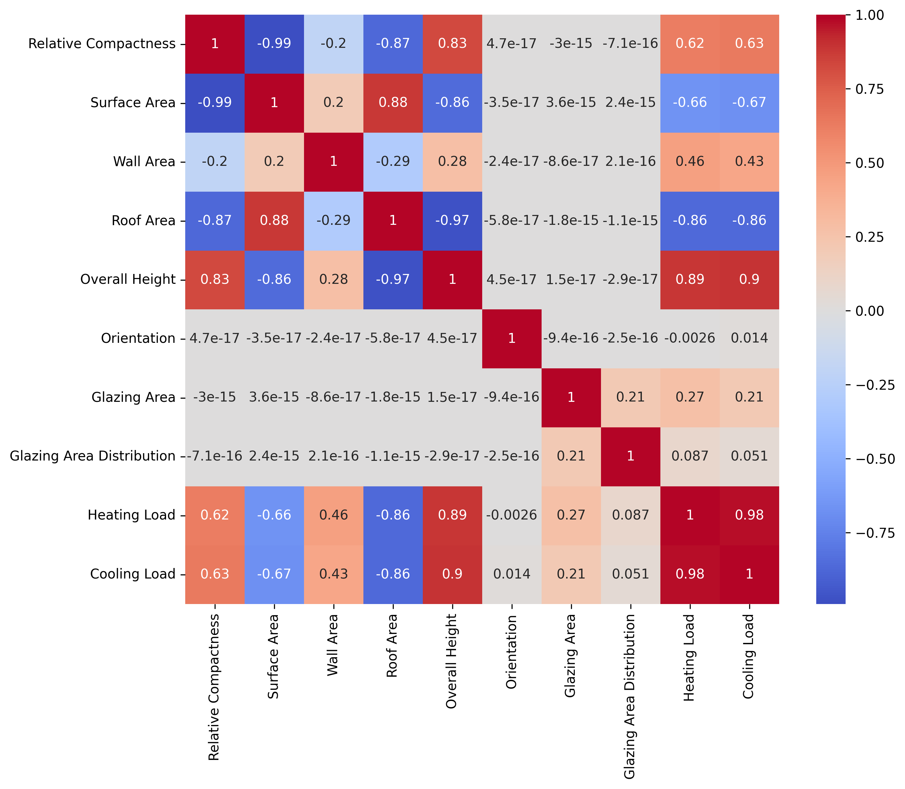
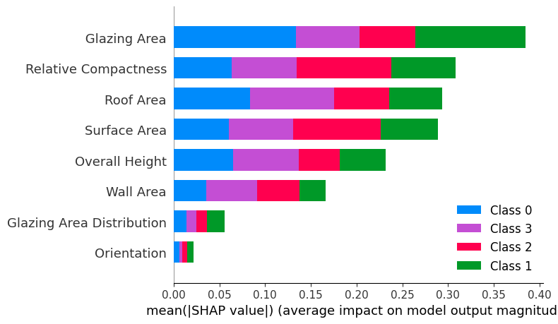

# Building energy efficiency classification
**Tools:** Python, scikit-learn, Pandas, NumPy, Seaborn, Matplotlib

**Summary:**

This project classifies residential buildings into energy efficiency categories based on architectural features using machine learning. It includes data preprocessing, feature engineering, model training with hyperparameter tuning, and ensemble learning through a VotingClassifier.

**Dataset:** 
- **Source**: [UCI Energy Efficiency Dataset](https://archive.ics.uci.edu/ml/datasets/energy+efficiency)
- **Records**: 768 buildings
- **Features**: 8 numerical architectural attributes
- **Targets**:
  - `Heating Load` (kWh/m²)
  - `Cooling Load` (kWh/m²)

**Analysis:**

- Performed data cleaning, correlation analysis, and quantile-based classification of energy loads
- Engineered a new target feature `charges_classes` from heating and cooling load sums
- Standardized numerical features and split dataset into train/test sets
- Trained and tuned KNN, SVM, and Random Forest classifiers using GridSearchCV
- Evaluated performance using confusion matrices and accuracy scores
- Combined top models into a hard voting ensemble to improve classification accuracy

**Key Skills:** Data preprocessing, classification modeling, hyperparameter tuning, ensemble methods, model evaluation, feature engineering

**Results:**
| Model             | Best Params                                 | Accuracy |
|-------------------|---------------------------------------------|----------|
| KNN               | `n_neighbors=3`                             | 0.95     |
| SVM               | `kernel='rbf   ', C=50`                     | 0.95     |
| **Random Forest** | `max_features='log2', min_samples_split=8 ` | **0.96** |
| VotingClassifier  | KNN + SVM + RF (hard vote)                  | 0.95 |

> **Random Forest** gave the best results overall.

**Feature correlation heatmap**

**SHAP summary**

